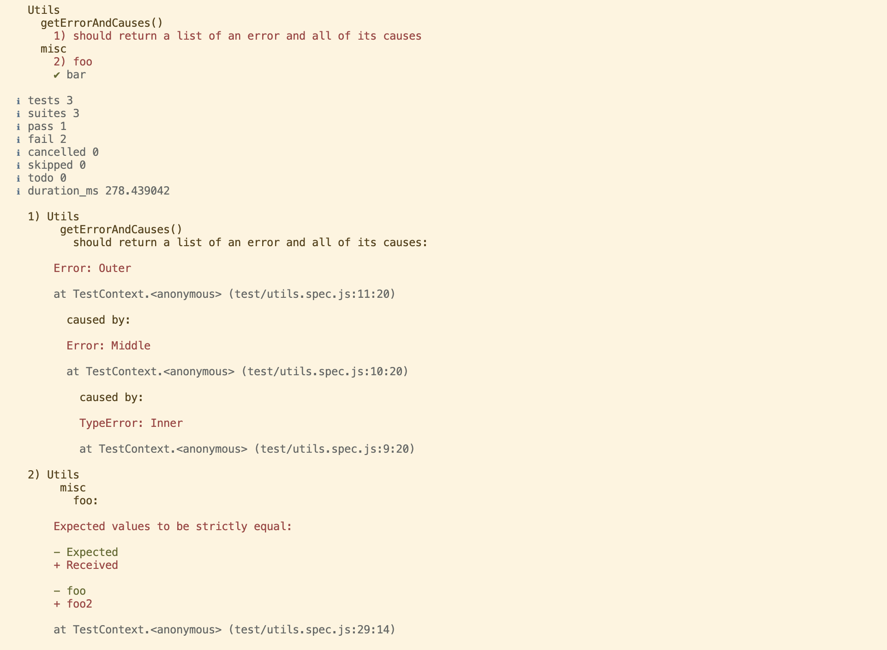

# @voxpelli/node-test-pretty-reporter

Reporter for [node:test](https://nodejs.org/api/test.html#custom-reporters) that supports colorful diffs etc

[](https://www.npmjs.com/package/@voxpelli/node-test-pretty-reporter)
[](https://www.npmjs.com/package/@voxpelli/node-test-pretty-reporter)
[](https://github.com/voxpelli/eslint-config)
[](https://github.com/voxpelli/badges-cjs-esm)
[](https://github.com/voxpelli/types-in-js)
[](https://mastodon.social/@voxpelli)

## Usage

```sh
npm install -D @voxpelli/node-test-pretty-reporter
```

```sh
node --test --test-reporter=@voxpelli/node-test-pretty-reporter
```

## Why another test reporter?

This one is similar to the built-in `spec` reporter but differs in some ways which I personally prefer.

### Rendering diffs from assertions

Outputs colored diffs when a test is failed with an `Error` that has `expected` and `actual` properties (respecting a `showDiff` property set to `false`).

Diff is generated by [`jest-diff`](https://www.npmjs.com/package/jest-diff) (no other part of `jest` is used in this reporter).

Assertion libraries that outputs compatible errors:
  * [`node:assert`](https://nodejs.org/api/assert.html#assert)
  * [`chai`](https://www.chaijs.com/) (**note:** `chai.should()` breaks error presentation since `18.17.0`, see: [voxpelli/node-test-pretty-reporter#6](https://github.com/voxpelli/node-test-pretty-reporter/issues/6), [nodejs/node#48918](https://github.com/nodejs/node/issues/48918), [chaijs/chai#1530](https://github.com/chaijs/chai/issues/1530))

As with other changes, this makes the reporter on par [with Mocha](https://mochajs.org/#diffs).

### Output styling

The output styling aligns more with Mocha's [`spec` reporter](https://mochajs.org/#spec):

* ~~Errors are presented at the end instead of in the list of tests~~ _(also done in built in since [nodejs/node#47164](https://github.com/nodejs/node/pull/47164))_
* Less visually intense, eg. no `▶` in front of names and only failed tests gets colored
* Durations are only reported if considered slow (using same default [as Mocha](https://mochajs.org/#test-duration): 75ms)
* No redundant mentioning of a test suite after the suite has completed – opts for a clean tree from top to bottom instead

### Outputting the full `cause` chain of an `Error`

When used with at least Node `18.17.0` or `20.2.0` this is supported (see [issue #2](https://github.com/voxpelli/node-test-pretty-reporter/issues/2)).

Since those same versions the cause chain is also printed in the built in `spec` reporter, but done through `util.inspect()` there rather than the custom output here.

### Example output



## Similar modules

I have not tested any of these myself yet so can't say if they work well or not, but adding here for reference.

* [`MoLow/reporters`](https://github.com/MoLow/reporters) – many custom reporters for `node:test`
* [`nearform/node-test-github-reporter`](https://github.com/nearform/node-test-github-reporter) – another custom report for `node:test`, this one from [@nearform](https://github.com/nearform) and geared towards GitHub Actions

## See also

* [`node:test`](https://nodejs.org/api/test.html) – the full documentation for the `node:test` module that shipped in Node.js 18
* [`nodejs/node-core-test`](https://github.com/nodejs/node-core-test) – a userland port of `node:test` making it available in Node.js 14 and later (this reporter has not been tested with this userland port)
* [`@matteo.collina/tspl`](https://github.com/mcollina/tspl) – test planner for `node:test` and `node:assert`
